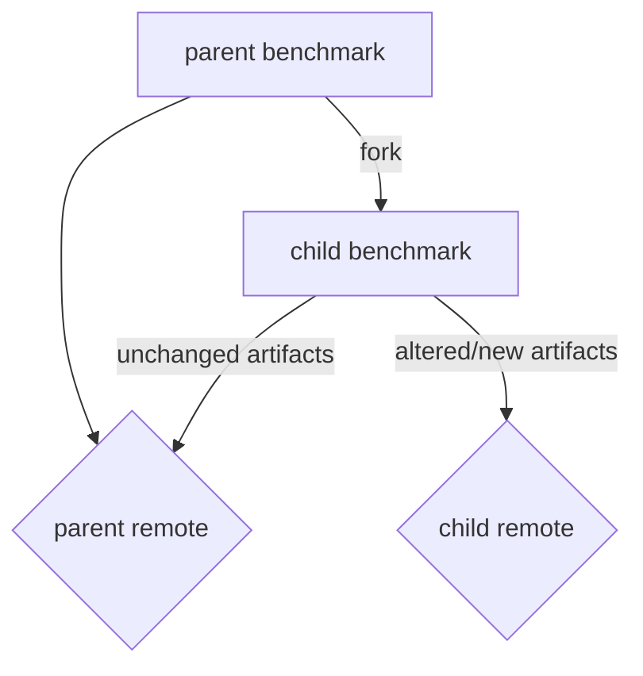

# 003: versioning of storage

[](https://github.com/omnibenchmark/docs/design)
[](https://github.com/omnibenchmark/docs/design)

**Authors**: Reto
**Date**: 2025-11-28
**Status**: Draft
**Version**: 0.1
**Supersedes**: N/A
**Reviewed-by**: TBD
**Related Issues**: [Links to related GitHub issues]

## Changes

| Version | Date | Description | Author |
|---------|------|-------------|--------|
| 0.1 | 2025-11-28 | Initial draft | Reto |

## 1. Problem Statement

The benchmark artifacts (i.e., the output of a benchmark run) should be uniquely linked to the benchmark yaml file when using remote storage (i.e., S3). More precisely, we want the remote tags to be unequivocally traced to a canonical representation of the benchmark YAML, up to equivalent block reorderings. This is particularly important for collaborative work or when benchmarks get forked. Currently this is not done, instead manual versions are created and files are only linked to the version written in the benchmark yaml, but there is no guarantee that the benchmark yaml file has not been modified otherwise. 
Desirable properties are:

- given the benchmark yaml, get artifacts (similar to `git pull`)
- given a remote, get available versions/labels (similar to `git log`)
- given a remote and a version/label, retrieve complete benchmark + artifacts (similar to `git checkout`)
- given a benchmark yaml, run and add artifacts (similar to `git commit`)
- given a benchmark yaml and artifacts, put artifacts to remote (similar to `git push`)


## 2. Design Goals

- Consistancy/Tracking: Unique assignment of benchmark output files (artifacts) to a unique benchmark yaml file.
- History: Retain ordering of versions
- Linkability: Forking of benchmark yaml should retain links to artifacts from parent benchmark yaml file.

### Non-Goals

- Validation: no check if artifact output is valid, should be handled separately
- Multi-remote: do not support automatic multi-remote syncing

## 3. Proposed Solution

### Versioning

For creating a version string for each artifact file two possibilities are proposed:

- `VERSION-HASH` (e.g., `0.1.0-8793a13`)
- `VERSION-LABEL-HASH` (e.g., `0.1.0-paper-8793a13`)

with:

- VERSION: version specified in the benchmark yaml
- HASH: hash of benchmark yaml (see below)
- LABEL: additional label 

The optional LABEL might be useful to have divergent versions on the same remote (e.g., same S3 bucket). For HASH the following is of importance:

- only keeping fields used for execution (no descriptions,...)
- (?) include env files
- (?) ...

The hash should be constructed in such a way that the same hash creates the same artifact files if the benchmark is run. However, since this cannot be guaranteed (e.g., because of randomness in methods), although it should if the benchmark is designed with reproducibility in mind, the first created version should be kept, i.e., files on the remote should not be overwritten. 

Whenever a benchmark is run, all artifacts should be either created and tagged, or only tagged (if no changes).


### Linkability

Consider the following:


A benchmark is forked, but the forked benchmark should still point to the same artifact output if no changes are made in the forked version. For tracking of the parent artifact output additional metadata in the child (forked) benchmark yaml needs to be specified, e.g.,

```
parent-yaml:
	version: 0.1.0
	hash: 8793a13
	yaml: http://link-to-yaml
	remote: S3://remote-data-bucket
```
Field `yaml` is theoretically not strictly required, but seems reasonable to track the origin of the parent yaml. Fields `version` and `remote` can be directly extracted from the parent benchmark yaml. Field `hash` (i.e., HASH) can be directly constructed from the parent benchmark yaml.


### Implementation Details

The current implementation for S3 already allows versioning files (by creating tags for objects in S3), however currently this is only done when manually specified. Thus automatic versioning as proposed above should be done for each benchmark run. 
Furthermore, so far handling the remote objects during execution has been done by snakemake. This could potentially be kept, but might require explicit remote plus file plus file version (label) usage (because of forking the files could reside in multiple buckets), which means extending the execution module. Alternative option is to handle remote files separately by a dedicated local cache, i.e., download needed files to cache and use those during execution. This will also require changes to the execution module, but allows for more control. Especially because if snakemake handles the remote files it will automatically upload these to the remote, which will mean the versioning (tagging on S3) needs to happen after completion of the benchmark run, which means in the meantime it could potentially be overwritten by another process. A dedicated cache should be saver in this regard.


## 4. Alternatives Considered


### Alternative 1: Manual versioning (current state)
- **Description**: As implemented currently, manual tagging of remote files to be included in a version
- **Pros**: simple, already implemented
- **Cons**: no guarantee that files are the expected files, especially in a collaborative setting. No forking possible

## 5. Implementation Plan

1. Phase 1: Hash of benchmark yaml
2. Phase 2: Child benchmark yaml, i.e., add additional fields
3. Phase 3: Local cache
4. Phase 4: automatic versioning
5. Phase 5: execution module update
6. ...

### Testing Strategy
TBD

## 6. References

1. [Current implementation](https://github.com/omnibenchmark/omnibenchmark/blob/main/omnibenchmark/io/README.md)
2. [snakemake S3 storage plugin](https://github.com/snakemake/snakemake-storage-plugin-s3)
