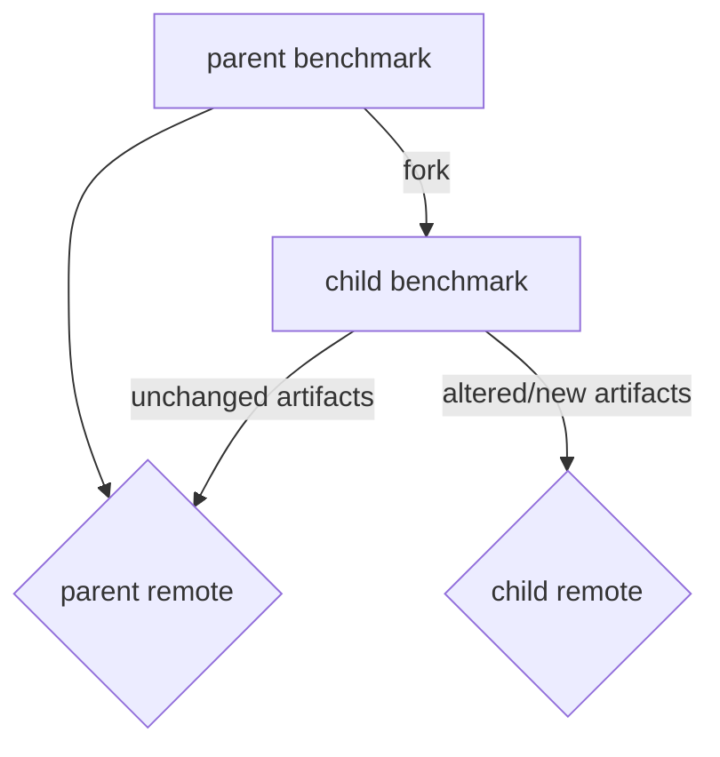

# 003: versioning of storage

[](https://github.com/omnibenchmark/docs/design)
[](https://github.com/omnibenchmark/docs/design)

**Authors**: Reto
**Date**: 2025-11-28
**Status**: Draft
**Version**: 0.1
**Supersedes**: N/A
**Reviewed-by**: TBD
**Related Issues**: [Links to related GitHub issues]

## Changes

| Version | Date | Description | Author |
|---------|------|-------------|--------|
| 0.1 | 2025-11-28 | Initial draft | Reto |

## 1. Problem Statement

The benchmark artifacts (i.e., the output of a benchmark run) should be uniquely linked to the benchmark yaml file when using remote storage (i.e., S3). More precisely, we want the remote tags to be unequivocally traced to a canonical representation of the benchmark YAML, up to equivalent block reorderings. This is particularly important for collaborative work or when benchmarks get forked. Currently this is not done, instead manual versions are created and files are only linked to the version written in the benchmark yaml, but there is no guarantee that the benchmark yaml file has not been modified otherwise. 
Desirable properties are:

- given the benchmark yaml, get artifacts (similar to `git pull`)
- given a remote, get available versions/labels (similar to `git log`)
- given a remote and a version/label, retrieve complete benchmark + artifacts (similar to `git checkout`)
- given a benchmark yaml, run and add artifacts (similar to `git commit`)
- given a benchmark yaml and artifacts, put artifacts to remote (similar to `git push`)


## 2. Design Goals

- Consistancy/Tracking: Unique assignment of benchmark output files (artifacts) to a unique benchmark yaml file.
- History: Retain ordering of versions
- Linkability: Forking of benchmark yaml should retain links to artifacts from parent benchmark yaml file.

### Non-Goals

- Validation: no check if artifact output is valid, should be handled separately
- Multi-remote: do not support automatic multi-remote syncing

## 3. Proposed Solution

### Versioning

For creating a version string for each artifact file two possibilities are proposed:

- `VERSION-HASH` (e.g., `0.1.0-8793a13`)
- `VERSION-LABEL-HASH` (e.g., `0.1.0-paper-8793a13`)

with:

- VERSION: version specified in the benchmark yaml
- HASH: hash of benchmark yaml (see below)
- LABEL: additional label 

The optional LABEL might be useful to have divergent versions on the same remote (e.g., same S3 bucket). For HASH the following is of importance:

- only keeping fields used for execution (no descriptions,...)
- (?) include env files
- (?) ...

The hash should be constructed in such a way that the same hash creates the same artifact files if the benchmark is run. However, since this cannot be guaranteed (e.g., because of randomness in methods), although it should if the benchmark is designed with reproducibility in mind, the first created version should be kept, i.e., files on the remote should not be overwritten. 

Whenever a benchmark is run, all artifacts should be either created and tagged, or only tagged (if no changes).


### Linkability

Consider the following:

```mermaid
flowchart TD
	A[parent benchmark] --> B{parent remote}
	A -->|fork| C[child benchmark]
	C -->|unchanged artifacts| B
	C -->|altered/new artifacts| D{child remote}
```

A benchmark is forked, but the forked benchmark should still point to the same artifact output if no changes are made in the forked version. For tracking of the parent artifact output additional metadata in the child (forked) benchmark yaml needs to be specified, e.g.,

```
parent-yaml:
	version: 0.1.0
	hash: 8793a13
	yaml: http://link-to-yaml
	remote: S3://remote-data-bucket
```
Field `yaml` is theoretically not strictly required, but seems reasonable to track the origin of the parent yaml. Fields `version` and `remote` can be directly extracted from the parent benchmark yaml. Field `hash` (i.e., HASH) can be directly constructed from the parent benchmark yaml.


### Implementation Details

The current implementation for S3 already allows versioning files (by creating tags for objects in S3), however currently this is only done when manually specified. Thus automatic versioning as proposed above should be done for each benchmark run. 
Furthermore, so far handling the remote objects during execution has been done by snakemake. This could potentially be kept, but might require explicit remote plus file plus file version (label) usage (because of forking the files could reside in multiple buckets), which means extending the execution module. Alternative option is to handle remote files separately by a dedicated local cache, i.e., download needed files to cache and use those during execution. This will also require changes to the execution module, but allows for more control. Especially because if snakemake handles the remote files it will automatically upload these to the remote, which will mean the versioning (tagging on S3) needs to happen after completion of the benchmark run, which means in the meantime it could potentially be overwritten by another process. A dedicated cache should be saver in this regard.


## 4. Alternatives Considered


### Alternative 1: Manual versioning (current state)
- **Description**: As implemented currently, manual tagging of remote files to be included in a version
- **Pros**: simple, already implemented
- **Cons**: no guarantee that files are the expected files, especially in a collaborative setting. No forking possible

## 5. Implementation Plan

1. ~~Phase 1: Hash of benchmark yaml~~ — implemented as `Benchmark.summary_hash()` (see design/004-yaml-specification.md Section 9). Covers execution-relevant fields only; follows the same canonicalize+sort+SHA256 convention as parameter set hashing. Short form (first 8 hex chars) is the `HASH` component of the `VERSION-HASH` artifact tag.
2. Phase 2: Child benchmark yaml — `provenance` block now accepted in YAML (see design/004-yaml-specification.md Section 9). The `subset_of` field stores the parent's `summary_hash()`.
3. Phase 3: Local cache
4. Phase 4: automatic versioning
5. Phase 5: execution module update
6. ...

### Testing Strategy
TBD

## 6. Current Implementation

This section documents how storage actually works in the current codebase (`omnibenchmark/remote/`).

### 6.1 Architecture Overview

Remote storage is backed by any S3-compatible object store (AWS S3, RustFS, etc.). The implementation
uses **S3 bucket versioning** combined with **S3 Object Lock** to achieve immutable, reproducible
benchmark snapshots. The core classes are:

| Class                 | File               | Role                                              |
|-----------------------|--------------------|---------------------------------------------------|
| `S3CompatibleStorage` | `S3Storage.py`     | Main implementation: connect, version, tag, lock  |
| `RemoteStorage`       | `RemoteStorage.py` | Abstract base class                               |
| `StorageOptions`      | `RemoteStorage.py` | Configures tracked directories and glob patterns  |
| `StorageService`      | `service.py`       | Thin facade used by CLI commands                  |

### 6.2 Prerequisites

A bucket **must** be created with **Object Lock enabled**. This cannot be changed after creation.
Object Lock implicitly enables S3 bucket versioning.

AWS CLI:
```bash
aws s3api create-bucket \
  --bucket <bucket-name> \
  --region <region> \
  --create-bucket-configuration LocationConstraint=<region> \
  --object-lock-enabled-for-bucket
```

AWS Console: Create bucket → Advanced settings → Object Lock ✓

If the bucket lacks Object Lock, `ob remote version create` will fail immediately with a clear error
before any objects are modified.

### 6.3 Bucket Layout

```
<bucket>/
├── config/
│   └── benchmark.yaml          # benchmark YAML uploaded on each version create
├── software/
│   └── *.yaml / *.eb / *.lua   # software environment files
├── out/                        # benchmark output files (configurable via out_dir)
│   └── <module>/<params>/...
└── versions/
    ├── 1.0.csv                 # version manifest: object keys + S3 version IDs
    └── 2.0.csv
```

The **tracked directories** (`config/`, `software/`, `versions/`, and `out/`) are the only
directories whose objects are included when a version snapshot is created.
`out/` is the only results directory; the others are metadata directories versioned in full on
every snapshot.

### 6.4 Credentials

Credentials are read from environment variables or a `.env` file:

| Variable                    | Description                                |
|-----------------------------|--------------------------------------------|
| `OB_STORAGE_S3_ACCESS_KEY`  | AWS/S3 access key ID                       |
| `OB_STORAGE_S3_SECRET_KEY`  | AWS/S3 secret access key                   |
| `OB_STORAGE_S3_ENDPOINT_URL`| Custom endpoint (omit for AWS S3)          |
| `AWS_DEFAULT_REGION`        | AWS region (default: `eu-central-1`)       |

The `.env` file is found by walking up from the current working directory — the first file found
wins. Variables already set in the environment are never overridden (`override=False`).

When credentials are present, **both** read and write clients use signed requests. When no
credentials are provided, an unsigned (anonymous) client is used — this only works for
publicly-readable buckets.

### 6.5 YAML Configuration

Storage is configured in the benchmark YAML. Two formats are accepted (but not mixed):

**New format (preferred):**
```yaml
storage:
  api: S3
  endpoint: https://s3.eu-north-1.amazonaws.com
  bucket_name: my-benchmark-bucket
```

**Legacy flat format (still supported):**
```yaml
storage: https://s3.eu-north-1.amazonaws.com
storage_api: S3
storage_bucket_name: my-benchmark-bucket
```

If step 6 fails, step 5's tags are rolled back. The locked objects remain in the bucket (they
cannot be deleted) but without their version tags, so they are not included in any version manifest.

### 6.7 S3 Versioning Semantics

Because S3 bucket versioning is enabled, every `PUT` to the same key creates a **new S3 object
version** without overwriting the old one. This means:

- Re-running `ob run` and uploading new outputs creates new S3 versions alongside the old ones.
- Tagged + locked versions from a previous `version create` are **permanently preserved**, even
  if the same key is later overwritten by a new run.
- `ob remote files download -v 1.0` always retrieves the exact object versions recorded in
  `versions/1.0.csv`, regardless of what was uploaded afterwards.

Object Lock **GOVERNANCE mode** prevents deletion and overwriting of a specific object version for
the retention period (1000 weeks ≈ 19 years). Bypassing it requires the
`s3:BypassGovernanceRetention` IAM permission.

### 6.8 Version Manifest (CSV)

`versions/<version>.csv` lists every object that belongs to the version:

```
name,version_id,last_modified,size,etag
out/iris/data/iris.features.csv,abc123,2026-01-01T10:00:00+00:00,1234,d41d...
config/benchmark.yaml,def456,2026-01-01T10:00:00+00:00,4567,e3b0...
...
```

The `version_id` column is the S3 object version ID — a stable pointer to the exact bytes,
independent of future uploads to the same key.

### 6.9 CLI Commands

- `ob remote version list YAML` — list available versions in the bucket
- `ob remote version create YAML` — create a new version snapshot
- `ob remote version diff YAML -v1 X -v2 Y` — unified diff of file lists between two versions
- `ob remote files list YAML` — list files in the configured version
- `ob remote files download YAML` — download files for the configured version

### 6.10 Known Limitations and Edge Cases

**Unchanged files get re-versioned.** If a file exists in version 1.0 but the new benchmark run
does not produce it (e.g. a module was removed), the 1.0-locked object version is still the
"newest" for that key. The pre-flight cleanup will remove its `1.0` tag, and it will be tagged as
the new version. This means files that did not change between runs are silently included in the
new version under the new version tag, which may not reflect actual benchmark execution.

**Retry safety.** If `version create` fails after locking objects but before writing the manifest,
the next retry removes stale version tags (pre-flight cleanup in step 5 above) before re-tagging,
making retries safe. The previously locked objects remain in the bucket but are untagged until the
retry completes.

**Bucket recreation.** Object Lock cannot be enabled on an existing bucket. If a bucket was
created without it, it must be deleted and recreated. Empty buckets are safe to delete; locked
buckets require `BypassGovernanceRetention` on each object version before deletion is possible.

**Public read access.** When a bucket is created by `_create_benchmark()`, a public read policy is
applied (`s3:GetObject` for `*`). This means anyone who knows the bucket name and object key can
download objects anonymously — including locked version artifacts. Restrict the bucket policy if
this is not desired.

## 7. References

1. [Current implementation](https://github.com/omnibenchmark/omnibenchmark/blob/main/omnibenchmark/io/README.md)
2. [snakemake S3 storage plugin](https://github.com/snakemake/snakemake-storage-plugin-s3)
3. [AWS S3 Object Lock documentation](https://docs.aws.amazon.com/AmazonS3/latest/userguide/object-lock.html)
4. [RustFS](https://github.com/RustFS/RustFS) — S3-compatible storage used in tests
