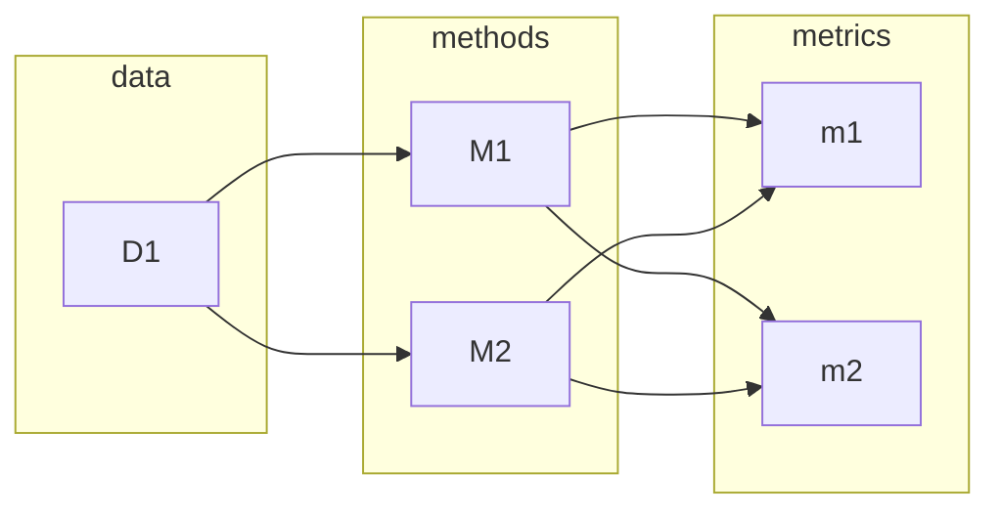
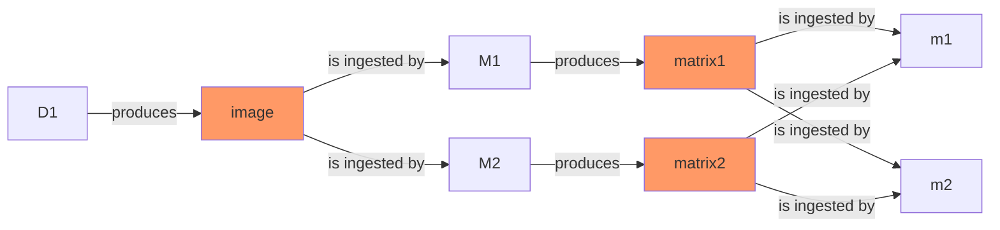
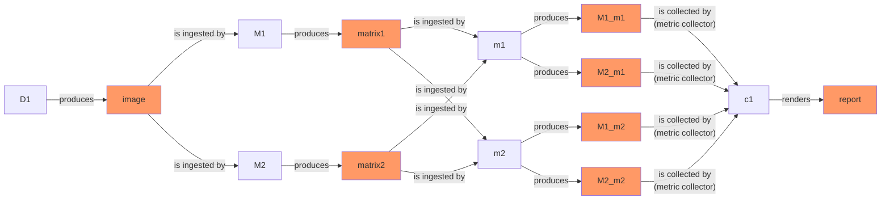

## Install omnibenchmark

Omnibenchmark runs on different operating systems (OS) and architectures. The installation procedure impacts omnibenchmark capabilities to manage software during benchmarking. We recommend installing using micromamba.


| capabilities              |  `system`           | `singularity`      |     `lmod`        |      `conda`         | 
| -----------               |  -------------------| ----------------   | ----------------- |  ----------------    | 
| `poetry`                  |  :material-check:   | :material-close:   | :material-close:  | :material-close:     |
| `pip`                     |  :material-check:   | :material-close:   | :material-close:  | :material-close:     |
| `mamba (e.g. micromamba)` |  :material-check:   | :material-check:   | :material-check:  | :material-check:     |


### Full install (micromamba)

#### apt-based Linux on amd64 architecture

First, install [micromamba](https://mamba.readthedocs.io/en/latest/installation/micromamba-installation.html), a faster conda manager and package solver.
    
=== "Shell"

    ```shell
    "${SHELL}" <(curl -L micro.mamba.pm/install.sh)
    ```

=== "Output"

    ```
    % Total    % Received % Xferd  Average Speed   Time    Time     Time  Current
                                     Dload  Upload   Total   Spent    Left  Speed
      0     0    0     0    0     0      0      0 --:--:-- --:--:-- --:--:--     0
    100  3059  100  3059    0     0   7059      0 --:--:-- --:--:-- --:--:--  7059
    Micromamba binary folder? [~/.local/bin] 
    Init shell (bash)? [Y/n] Y
    Configure conda-forge? [Y/n] n
    Prefix location? [~/micromamba] 
    Modifying RC file "/home/user/.bashrc"
    Generating config for root prefix "/home/user/micromamba"
    Setting mamba executable to: "/home/user/.local/bin/micromamba"
    Adding (or replacing) the following in your "/home/user/.bashrc" file
    
    # >>> mamba initialize >>>
    # !! Contents within this block are managed by 'mamba init' !!
    export MAMBA_EXE='/home/user/.local/bin/micromamba';
    export MAMBA_ROOT_PREFIX='/home/user/micromamba';
    __mamba_setup="$("$MAMBA_EXE" shell hook --shell bash --root-prefix "$MAMBA_ROOT_PREFIX" 2> /dev/null)"
    if [ $? -eq 0 ]; then
        eval "$__mamba_setup"
    else
        alias micromamba="$MAMBA_EXE"  # Fallback on help from mamba activate
    fi
    unset __mamba_setup
    # <<< mamba initialize <<<
    
    Please restart your shell to activate micromamba or run the following:\n
    source ~/.bashrc (or ~/.zshrc, ~/.xonshrc, ~/.config/fish/config.fish, ...)
    ```
    
Then, clone omnibenchmark and install it in a new micromamba environment.

=== "Shell"

    ```shell
    git clone git@github.com:omnibenchmark/omnibenchmark.git
    
    cd omnibenchmark
    
    micromamba activate
    micromamba create -n omnibenchmark
    micromamba activate omnibenchmark
    micromamba install -f test-environment.yml
    ```
    
=== "Output"

    ```
    
    micromamba create -n omnibenchmark
    micromamba activate omnibenchmark
    micromamba install -f test-environment.yaml
    Empty environment created at prefix: /home/user/micromamba/envs/omnibenchmark
    info     libmamba ****************** Backtrace Start ******************
    debug    libmamba Loading configuration
    trace    libmamba Compute configurable 'create_base'
    trace    libmamba Compute configurable 'no_env'
    trace    libmamba Compute configurable 'no_rc'
    trace    libmamba Compute configurable 'rc_files'
    trace    libmamba Compute configurable 'root_prefix'
    
    [snip]
    
      + conda-libmamba-solver          24.7.0  pyhd8ed1ab_0           conda-forge     Cached
      + mamba                           1.5.8  py312h9460a1c_0        conda-forge     Cached
    
      Summary:
    
      Install: 93 packages
    
      Total download: 0 B
    
    ──────────────────────────────────────────────────────────────────────────────────────────
    
    
    Confirm changes: [Y/n] y
    
    [snip]
    
    Successfully built omnibenchmark omni-schema
    Installing collected packages: toposort, throttler, stopit, sortedcontainers, pytz, plac, fastjsonschema, easybuild-framework, easybuild-easyconfigs, easybuild-easyblocks, distlib, connection-pool, async, appdirs, wrapt, tzdata, typing-extensions, traitlets, tabulate, soupsieve, smmap, six, shellingham, rpds-py, reretry, pyyaml, pytrie, pyparsing, pyjwt, pygments, pycryptodome, pulp, psutil, numpy, nodeenv, multidict, mdurl, MarkupSafe, lxml, jmespath, isort, iniconfig, immutables, identify, humanfriendly, hbreader, frozenlist, filelock, execnet, easybuild, dpath, docutils, datrie, coverage, configargparse, click, cfgv, attrs, argparse-dataclass, annotated-types, aiohappyeyeballs, yte, yarl, virtualenv, snakemake-interface-common, smart-open, referencing, python-swiftclient, python-dateutil, pytest, pynacl, pydantic-core, markdown-it-py, jupyter-core, jsonasobj2, json-flattener, jinja2, isodate, gitdb, docker, deprecated, cryptography, conda-inject, beautifulsoup4, argon2-cffi-bindings, aiosignal, testcontainers, snakemake-interface-storage-plugins, snakemake-interface-report-plugins, snakemake-interface-executor-plugins, rich, rdflib, pytest-xdist, pytest-split, pytest-logging, pytest-cov, pydantic, pre-commit, pandas, jsonschema-specifications, gitpython, bs4, botocore, argon2-cffi, aiohttp, typer, s3transfer, pygithub, prefixcommons, minio, jsonschema, curies, snakedeploy, prefixmaps, nbformat, boto3, snakemake, linkml-runtime, omni-schema, omnibenchmark
    Successfully installed MarkupSafe-2.1.5 aiohappyeyeballs-2.3.7 aiohttp-3.10.4 aiosignal-1.3.1 annotated-types-0.7.0 appdirs-1.4.4 argon2-cffi-23.1.0 argon2-cffi-bindings-21.2.0 argparse-dataclass-2.0.0 async-0.6.2 attrs-24.2.0 beautifulsoup4-4.12.3 boto3-1.35.0 botocore-1.35.0 bs4-0.0.2 cfgv-3.4.0 click-8.1.7 conda-inject-1.3.2 configargparse-1.7 connection-pool-0.0.3 coverage-7.6.1 cryptography-43.0.0 curies-0.7.10 datrie-0.8.2 deprecated-1.2.14 distlib-0.3.8 docker-7.1.0 docutils-0.21.2 dpath-2.2.0 easybuild-4.9.2 easybuild-easyblocks-4.9.2 easybuild-easyconfigs-4.9.2 easybuild-framework-4.9.2 execnet-2.1.1 fastjsonschema-2.20.0 filelock-3.15.4 frozenlist-1.4.1 gitdb-4.0.11 gitpython-3.1.43 hbreader-0.9.1 humanfriendly-10.0 identify-2.6.0 immutables-0.20 iniconfig-2.0.0 isodate-0.6.1 isort-5.13.2 jinja2-3.1.4 jmespath-1.0.1 json-flattener-0.1.9 jsonasobj2-1.0.4 jsonschema-4.23.0 jsonschema-specifications-2023.12.1 jupyter-core-5.7.2 linkml-runtime-1.8.1 lxml-5.3.0 markdown-it-py-3.0.0 mdurl-0.1.2 minio-7.2.8 multidict-6.0.5 nbformat-5.10.4 nodeenv-1.9.1 numpy-2.1.0 omni-schema-0.0.1 omnibenchmark-0.1.0 pandas-2.2.2 plac-1.4.3 pre-commit-3.8.0 prefixcommons-0.1.12 prefixmaps-0.2.5 psutil-6.0.0 pulp-2.8.0 pycryptodome-3.20.0 pydantic-2.8.2 pydantic-core-2.20.1 pygithub-2.3.0 pygments-2.18.0 pyjwt-2.9.0 pynacl-1.5.0 pyparsing-3.1.2 pytest-8.3.2 pytest-cov-4.1.0 pytest-logging-2015.11.4 pytest-split-0.9.0 pytest-xdist-3.6.1 python-dateutil-2.9.0.post0 python-swiftclient-4.6.0 pytrie-0.4.0 pytz-2024.1 pyyaml-6.0.2 rdflib-7.0.0 referencing-0.35.1 reretry-0.11.8 rich-13.7.1 rpds-py-0.20.0 s3transfer-0.10.2 shellingham-1.5.4 six-1.16.0 smart-open-7.0.4 smmap-5.0.1 snakedeploy-0.10.0 snakemake-8.18.1 snakemake-interface-common-1.17.3 snakemake-interface-executor-plugins-9.2.0 snakemake-interface-report-plugins-1.0.0 snakemake-interface-storage-plugins-3.3.0 sortedcontainers-2.4.0 soupsieve-2.6 stopit-1.1.2 tabulate-0.9.0 testcontainers-4.8.0 throttler-1.2.2 toposort-1.10 traitlets-5.14.3 typer-0.12.4 typing-extensions-4.12.2 tzdata-2024.1 virtualenv-20.26.3 wrapt-1.16.0 yarl-1.9.4 yte-1.5.4
    
    ```

##### Install singularity, debootstrap and fakeroot

Before proceeding, make sure to install [apptainer](https://apptainer.org/docs/admin/main/installation.html) (formerly singularity) as the containerization solution, as well as some other system-wide dependencies.

After checking that apptainer is available, you should ensure **debootstrap** is available for building debian-based containers, and make sure to configure **fakeroot** with [`singularity config fakeroot`](https://docs.sylabs.io/guides/3.5/admin-guide/user_namespace.html#config-fakeroot) to allow non-root users to simulate root privileges while managing containers.

Do note that you will need `debootstrap` even if you're using a non-debian based linux.

The following should get you covered:

Finally, install [apptainer](https://apptainer.org/docs/admin/main/installation.html) (singularity) and further system dependencies. If apptainer is already installed, make sure **debootstrap** is also installed and **fakeroot** configured with [`singularity config fakeroot`](https://docs.sylabs.io/guides/3.5/admin-guide/user_namespace.html#config-fakeroot).

```shell
sudo apt install lua5.2 liblua5.2-dev lua-filesystem lua-posix tcl tcl-dev wget debootstrap software-properties-common
sudo add-apt-repository -y ppa:apptainer/ppa
sudo apt update
sudo apt install openmpi-bin libopenmpi-dev apptainer
```

Check everything works with:

=== "Shell"

    ```shell
    ob software check --what singularity
    ob software check --what conda
    ob software check --what easybuild
    ob software check --what module
    ```

=== "Output"
    
    ```
    Checking software stack handlers / backends (singularity, easybuild, etc).
    OK: CompletedProcess(args=['singularity', '--version'], returncode=0, stdout='singularity version 3.5.2\n', std  err='')
    
    Checking software stack handlers / backends (singularity, easybuild, etc).
    OK: CompletedProcess(args=['conda', '--version'], returncode=0, stdout='conda 24.7.1\n', stderr='')
    
    Checking software stack handlers / backends (singularity, easybuild, etc).
    OK: CompletedProcess(args=['eb', '--version'], returncode=0, stdout='This is EasyBuild 4.9.2 (framework: 4.9.2, easyblocks: 4.9.2) on host imlssherborne.\n', stderr='')
    
    Checking software stack handlers / backends (singularity, easybuild, etc).
    OK: CompletedProcess(args=['type', 'module'], returncode=0, stdout='', stderr='')
    ```

#### MacOS

We assume your user has sudo power.

First, install homebrew.

=== "Shell"

    ```shell
    bash
    /bin/bash -c "$(curl -fsSL https://raw.githubusercontent.com/Homebrew/install/HEAD/install.sh)"
    export PATH=/opt/homebrew/bin:$PATH
    brew --version
    ```
    
=== "Output"

    ```
    [snip]
    Homebrew 4.3.17
    ```

Then, install omnibenchmark dependencies, including lmod and micromamba.

=== "Shell"

    ```shell
    brew upgrade
    brew install coreutils
    brew install gcc
    brew install python
    brew install git
    brew install git-lfs
    brew install lmod             
    if [ -f /usr/local/opt/lmod/init/profile ]; then
        source /usr/local/opt/lmod/init/profile
    fi
    if [ -f /opt/homebrew/opt/lmod/init/profile ]; then
        source /opt/homebrew/opt/lmod/init/profile
    fi

    brew install wget
    brew reinstall cmake
    brew install micromamba
    module --version
    micromamba --version
    ```
    
=== "Output"

    ```
    Modules based on Lua: Version ---
       by Robert McLay mclay@tacc.utexas.edu
    
    1.5.8
    ```

Clone omnibenchmark.

=== "Shell"

    ```
    git clone https://github.com/omnibenchmark/omnibenchmark/
    
    cd omnibenchmark
    ```
    
=== "Output"

    ```
    (no output)
    ```

Using micromamba, install omnibenchmark.

=== "Shell"

    ```shell
    eval "$(micromamba shell hook --shell bash)"
    micromamba create -n omnibenchmark
    micromamba activate omnibenchmark
    micromamba install -f mac-test-environment.yml
    ```
    
=== "Output"

    ```
    [snip]
        Successfully built omnibenchmark omni-schema
    Installing collected packages: toposort, throttler, stopit, sortedcontainers, pytz, plac, fastjsonschema, easybuild-framework, easybuild-easyconfigs, easybuild-easyblocks, distlib, connection-pool, async, appdirs, wrapt, tzdata, typing-extensions, traitlets, tabulate, soupsieve, smmap, six, shellingham, rpds-py, reretry, pyyaml, pytrie, pyparsing, pyjwt, pygments, pycryptodome, pulp, psutil, numpy, nodeenv, multidict, mdurl, MarkupSafe, lxml, jmespath, isort, iniconfig, immutables, identify, humanfriendly, hbreader, frozenlist, filelock, execnet, easybuild, dpath, docutils, datrie, coverage, configargparse, click, cfgv, attrs, argparse-dataclass, annotated-types, aiohappyeyeballs, yte, yarl, virtualenv, snakemake-interface-common, smart-open, referencing, python-swiftclient, python-dateutil, pytest, pynacl, pydantic-core, markdown-it-py, jupyter-core, jsonasobj2, json-flattener, jinja2, isodate, gitdb, docker, deprecated, cryptography, conda-inject, beautifulsoup4, argon2-cffi-bindings, aiosignal, testcontainers, snakemake-interface-storage-plugins, snakemake-interface-report-plugins, snakemake-interface-executor-plugins, rich, rdflib, pytest-xdist, pytest-split, pytest-logging, pytest-cov, pydantic, pre-commit, pandas, jsonschema-specifications, gitpython, bs4, botocore, argon2-cffi, aiohttp, typer, s3transfer, pygithub, prefixcommons, minio, jsonschema, curies, snakedeploy, prefixmaps, nbformat, boto3, snakemake, linkml-runtime, omni-schema, omnibenchmark
    Successfully installed MarkupSafe-2.1.5 aiohappyeyeballs-2.3.7 aiohttp-3.10.4 aiosignal-1.3.1 annotated-types-0.7.0 appdirs-1.4.4 argon2-cffi-23.1.0 argon2-cffi-bindings-21.2.0 argparse-dataclass-2.0.0 async-0.6.2 attrs-24.2.0 beautifulsoup4-4.12.3 boto3-1.35.0 botocore-1.35.0 bs4-0.0.2 cfgv-3.4.0 click-8.1.7 conda-inject-1.3.2 configargparse-1.7 connection-pool-0.0.3 coverage-7.6.1 cryptography-43.0.0 curies-0.7.10 datrie-0.8.2 deprecated-1.2.14 distlib-0.3.8 docker-7.1.0 docutils-0.21.2 dpath-2.2.0 easybuild-4.9.2 easybuild-easyblocks-4.9.2 easybuild-easyconfigs-4.9.2 easybuild-framework-4.9.2 execnet-2.1.1 fastjsonschema-2.20.0 filelock-3.15.4 frozenlist-1.4.1 gitdb-4.0.11 gitpython-3.1.43 hbreader-0.9.1 humanfriendly-10.0 identify-2.6.0 immutables-0.20 iniconfig-2.0.0 isodate-0.6.1 isort-5.13.2 jinja2-3.1.4 jmespath-1.0.1 json-flattener-0.1.9 jsonasobj2-1.0.4 jsonschema-4.23.0 jsonschema-specifications-2023.12.1 jupyter-core-5.7.2 linkml-runtime-1.8.1 lxml-5.3.0 markdown-it-py-3.0.0 mdurl-0.1.2 minio-7.2.8 multidict-6.0.5 nbformat-5.10.4 nodeenv-1.9.1 numpy-2.1.0 omni-schema-0.0.1 omnibenchmark-0.1.0 pandas-2.2.2 plac-1.4.3 pre-commit-3.8.0 prefixcommons-0.1.12 prefixmaps-0.2.5 psutil-6.0.0 pulp-2.8.0 pycryptodome-3.20.0 pydantic-2.8.2 pydantic-core-2.20.1 pygithub-2.3.0 pygments-2.18.0 pyjwt-2.9.0 pynacl-1.5.0 pyparsing-3.1.2 pytest-8.3.2 pytest-cov-4.1.0 pytest-logging-2015.11.4 pytest-split-0.9.0 pytest-xdist-3.6.1 python-dateutil-2.9.0.post0 python-swiftclient-4.6.0 pytrie-0.4.0 pytz-2024.1 pyyaml-6.0.2 rdflib-7.0.0 referencing-0.35.1 reretry-0.11.8 rich-13.7.1 rpds-py-0.20.0 s3transfer-0.10.2 shellingham-1.5.4 six-1.16.0 smart-open-7.0.4 smmap-5.0.1 snakedeploy-0.10.0 snakemake-8.18.1 snakemake-interface-common-1.17.3 snakemake-interface-executor-plugins-9.2.0 snakemake-interface-report-plugins-1.0.0 snakemake-interface-storage-plugins-3.3.0 sortedcontainers-2.4.0 soupsieve-2.6 stopit-1.1.2 tabulate-0.9.0 testcontainers-4.8.0 throttler-1.2.2 toposort-1.10 traitlets-5.14.3 typer-0.12.4 typing-extensions-4.12.2 tzdata-2024.1 virtualenv-20.26.3 wrapt-1.16.0 yarl-1.9.4 yte-1.5.4
    ```


Check everything except singularity works with:

=== "Shell"

    ```shell
    ob software check --what singularity ## should fail
    ob software check --what conda
    ob software check --what easybuild
    ob software check --what module
    ```

=== "Output"
    
    ```
    Checking software stack handlers / backends (singularity, easybuild, etc).
    FAILED
    
    Checking software stack handlers / backends (singularity, easybuild, etc).
    OK: CompletedProcess(args=['conda', '--version'], returncode=0, stdout='conda 24.7.1\n', stderr='')
    
    Checking software stack handlers / backends (singularity, easybuild, etc).
    OK: CompletedProcess(args=['eb', '--version'], returncode=0, stdout='This is EasyBuild 4.9.2 (framework: 4.9.2, easyblocks: 4.9.2) on host imlssherborne.\n', stderr='')
    
    Checking software stack handlers / backends (singularity, easybuild, etc).
    OK: CompletedProcess(args=['type', 'module'], returncode=0, stdout='', stderr='')
    ```

### Slim install (python package)

You can install omnibenchmark as a python package. For that, you could use pip or poetry. To be able to run benchmarks you'll have to install `lmod` in your system. To be able to run benchmarks using singularity, you'll have to install `singularity` (apptainer) and `debootstrap` yourself.

#### With pip

You might want to configure a virtualenv. Omnibenchmark requires python >= 3.12.

=== "Shell"

    ```
    git clone https://github.com/omnibenchmark/omnibenchmark
    cd omnibenchmark
    pip install .
    ```


#### With poetry

Omnibenchmark requires python >= 3.12.
 
=== "Shell"

    ```
    git clone https://github.com/omnibenchmark/omnibenchmark
    cd omnibenchmark
    poetry install
    poetry shell
    ```

## Install software using envmodules

Omnibenchmark wraps easybuild to install easyconfigs.

First search an appropriate [easyconfig](https://docs.easybuild.io/). We suggest installing `zlib-1.3` with the system toolchain - it should be quick. First, we make sure we can find an easyconfig named `zlib-1.3.1.eb`.

=== "Shell"

    ```shell
    eb --search zlib-1.3
    ```
    
=== "Output"

    ```
    == found valid index for /home/user/micromamba/envs/omnibenchmark/easybuild/easyconfigs, so using it...
     * /home/user/micromamba/envs/omnibenchmark/easybuild/easyconfigs/z/zlib/zlib-1.3.1-GCCcore-13.3.0.eb
     * /home/user/micromamba/envs/omnibenchmark/easybuild/easyconfigs/z/zlib/zlib-1.3.1-GCCcore-14.1.0.eb
     * /home/user/micromamba/envs/omnibenchmark/easybuild/easyconfigs/z/zlib/zlib-1.3.1.eb
    
    ```
    
Then, we install it with omnibenchmark.

=== "Shell"

    ```shell
    ob software module build -e zlib-1.3.1.eb
    ```
    
=== "Output"

    ```
    Installing software for zlib-1.3.1.eb using easybuild. It will take some time.
    == found valid index for /home/user/micromamba/envs/omnibenchmark/easybuild/easyconfigs, so using it...
    == Temporary log file in case of crash /home/user/tmp/eb-t0ep4yar/eb-ny7hkqq2/easybuild-7my819c_.log
    == found valid index for /home/user/micromamba/envs/omnibenchmark/easybuild/easyconfigs, so using it...
    == resolving dependencies ...
    == processing EasyBuild easyconfig /home/user/micromamba/envs/omnibenchmark/easybuild/easyconfigs/z/zlib/zlib-1.3.1.eb
    == building and installing zlib/1.3.1...
    == fetching files...
    == ... (took 2 secs)
    == creating build dir, resetting environment...
    == unpacking...
    == patching...
    == preparing...
    == configuring...
    == ... (took 1 secs)
    == building...
    == ... (took 6 secs)
    == testing...
    == installing...
    == ... (took 14 secs)
    == taking care of extensions...
    == restore after iterating...
    == postprocessing...
    == sanity checking...
    == cleaning up...
    == creating module...
    == permissions...
    == packaging...
    == COMPLETED: Installation ended successfully (took 26 secs)
    == Results of the build can be found in the log file(s) /home/user/.local/easybuild/software/zlib/1.3.1/easybuild/easybuild-zlib-1.3.1-20240820.082959.log
    
    == Build succeeded for 1 out of 1
    == Temporary log file(s) /home/user/tmp/eb-t0ep4yar/eb-ny7hkqq2/easybuild-7my819c_.log* have been removed.
    == Temporary directory /home/user/tmp/eb-t0ep4yar/eb-ny7hkqq2 has been removed.
    DONE
    ```
    

Then, we check whether we can find the associated module to this easyconfig.

=== "Shell"
    
    ```shell
    source "$LMOD_PKG"/init/profile
    module use "$HOME"/.local/easybuild/modules/all
    module spider zlib
    ```
    
=== "Output"

    ```
    module use "$HOME"/.local/easybuild/modules/all
    module spider zlib
    
    ----------------------------------------------------------------------------------------------------------------------------------------------------------
      zlib: zlib/1.3.1
    ----------------------------------------------------------------------------------------------------------------------------------------------------------
        Description:
          zlib is designed to be a free, general-purpose, legally unencumbered -- that is, not covered by any patents -- lossless data-compression library
          for use on virtually any computer hardware and operating system. 
    
    
        This module can be loaded directly: module load zlib/1.3.1
    
        Help:
          
          Description
          ===========
          zlib is designed to be a free, general-purpose, legally unencumbered -- that
           is, not covered by any patents -- lossless data-compression library for use
           on virtually any computer hardware and operating system.
          
          
          More information
          ================
           - Homepage: https://www.zlib.net/
          
    
    
    ----------------------------------------------------------------------------------------------------------------------------------------------------------
      lib/zlib: lib/zlib/1.3.1
    ----------------------------------------------------------------------------------------------------------------------------------------------------------
        Description:
          zlib is designed to be a free, general-purpose, legally unencumbered -- that is, not covered by any patents -- lossless data-compression library
          for use on virtually any computer hardware and operating system. 
    
    
        This module can be loaded directly: module load lib/zlib/1.3.1
    
        Help:
          
          Description
          ===========
          zlib is designed to be a free, general-purpose, legally unencumbered -- that
           is, not covered by any patents -- lossless data-compression library for use
           on virtually any co
    ```
    
To load the module, we have to guess the module name from the easyconfig name. We are using a `flat` module naming known as [EasyBuildMNS](https://tutorial.easybuild.io/2021-lust/module_naming_schemes/). So the module name is `zlib/1.3.1`.

```shell
module load zlib/1.3.1
module list
```

We can unload the module with

```
module unload zlib/1.3.1
```

## Install software using singularity

To install software with easybuild inside a container, you can use `ob software singularity` commands.

First search an appropriate [easyconfig](https://docs.easybuild.io/). We suggest installing `cowsay`, which is a nice say of saying hello world in the terminal, with the system toolchain. First, we make sure we can find an easyconfig named `cowsay`:

```bash
eb --search cowsay
```

As of this writing, there is only one version of the application, namely `cowsay-3.04.eb`.

Then, we install it with omnibenchmark (do note that we'll be pinning the version too). This will generate a Singularity Image File (SIF), named `cowsay-3.04.eb.sif`:

```bash
ob software singularity build -e cowsay-3.04.eb
```

Now that we have built the SIF image, we can execute commands inside the singularity container. Let's do that as a way to verify that the image was correctly created.

=== "Shell"

    ```bash
    singularity exec cowsay-3.04.eb.sif cowsay hello from singularity!
    ```
 
=== "Output"

    ```
     _________________________
    < hello from singularity! >
     -------------------------
            \   ^__^
             \  (oo)\_______
                (__)\       )\/\
                    ||----w |
                    ||     ||
    ```


## Design a benchmark YAML

Benchmark specification files are written in YAML. They specify the formal
dependencies of benchmark components, as well as some metadata (e.g. the
repository containing their implementation, parameters to be run with, etc.).


Let's construct a simple example benchmark, shaped as follows:

- `D1` is a single (starting) dataset. (In real life, datasets will have meaningful
  names, e.g. `semisimulation_smith_2019`).
- `M1` and `M2` are methods. They process the dataset `D1` directly.
  (Similarly, methods would also have proper names, e.g. `limma` or `linreg`).
- `m1` and `m2` are metrics. They process the output of the methods `M1` and `M2` 
  directly. (Again, naming is flexible, we're keeping it short for clarity.)




Benchmark specification files have a header and a body.

### Benchmark YAML header

Let's start with the header. 

```yaml
---
## benchmark shortname
id: bench1

## benchmark description
description: a simple benchmark

## Benchmark version. `1.0`. This is our first attempt, so let's call it major version 1, minor version 0: `1.0`.
version: 1.0                                           

## Benchmark builder/contact person
benchmarker: "Mary the Benchmarker, mary@uzh.ch"

## Storage flavour for sharing results: currently only S3
storage_api: S3

## S3 endpoint to share our benchmark results. 
##   `https://s3_object_storage_url.ch` does not exist, and we don't mind - 
##   not sharing results from our benchmark yet.
storage: https://s3_object_storage_url.ch              

## Benchmark YAML schema/specification version. Currently `0.01`.
benchmark_yaml_spec: 0.01

## License
## license: MIT  # not yet part of the schema

## The software backend used to run the benchmark
software_backend: apptainer

## Software environment recipes associated to this benchmark. 
##  Suffice to say they are singularity images in some ORAS-compatible registry.
software_environments:                                 
  R:
    description: "R 4.3.3 with gfbf-2023 toolchain"
    apptainer: http://registry.ch/R_4.3.3-gfbf-2023b.sif
  python:
    description: "Python3.12.0 with gfbf-2023 toolchain"
    apptainer: http://registry.ch/python_vX-gfbf-2023b.sif
```
 
Hence, the header acts as a preamble, defining general attributes of the benchmark. The body contains the individual benchmark components (methods, metrics, etc) and their linking to each other.

### Benchmark YAML body

The benchmark body is structured in stages grouping benchmarking components that produce similarly shaped outputs and ingest similarly shaped inputs. That is: 



In this example, `matrix1` and `matrix2` are similarly shaped, e.g. might be tab-separated files with some constraints, such as having a header and a rownames; and different from `image`, which might be a raster image in PNG format. We require `D1` to be part of a stage where modules *produce images, and ingest no inputs*; `M1` and `M2` to belong to a stage of *image-ingesting, matrix-producing* modules; and `m1` and `m2` to be part of a last stage of *matrix-ingesting* modules.

Let's start with the first stage, containing `D1`. We will call it `data` (naming is flexible).
    
```yaml
stages:
    ## the stage name
  - id: data
    ##  here we have a single data stage with one single module, 
    ##  that outputs a single shape for the `data` stage.
    modules:                                               
        ## unique module id
      - id: D1
        ## module name in a longer form
        name: "Dataset 1"
        ## software environment to run this module; maps to the header `software_environments`
        software_environment: "python"
        ## the git-compatible remote, and a particular pinned commit
        repository:
          url: https://github.com/omnibenchmark-example/data.git
          commit: 41aaa0a
    ## output file paths for this stage members. In this simple case, the output from D1.
    outputs:
        ## output id
      - id: data.image
        ## output path. Wildcards will get dynamicly resoved to:
        ##   input: the project root working directory
        ##   stage: `data` (current stage id)
        ##   module: `D1` (the only module in the `data` stage)
        ##   params: `empty` (no parameters added)
        ##   dataset: `D1` (module ids in initial stages - that is, the ones not ingesting inputs and only
        ##     generating outputs, are reused as `dataset` wildcards)
        path: "{input}/{stage}/{module}/{params}/{dataset}.png"
```

Let's add another stage, for the modules `M1` and `M2`.
This stage is not initial: its modules have both inputs and outputs.

```yaml
    ## the stage name
  - id: methods
    ## a list of modules and their repositories, as above
    modules:
      - id: M1
        software_environment: "python"
        repository:
          url: https://github.com/omnibenchmark-example/method.git
          commit: 1004cdd
      - id: M2
        ## notice this method runs in a container offering some R capabilities
        software_environment: "R"
        repository:
          url: https://github.com/omnibenchmark-example/method2.git
          commit: 10sg4cdd
    ## input identifiers, refering to the `data stage` outputs
    inputs:
      - entries: data.image
    ## stage-specific outputs
    outputs:
      - id: methods.matrix
        ## output path. Wildcards will get dynamicly resoved to:
        ##   input: not the project root anymore, but the path to the deepest file input
        ##   stage: `methods` (current stage id)
        ##   module: `M1` or `M2`
        ##   params: `empty` (no parameters added)
        ##   dataset: `D1` (here datasets refer to the initial stage above, not to the module name)
        path: "{input}/{stage}/{module}/{params}/{dataset}.matrix.tsv.gz"
```

You might be wondering: what does the wildcard `{input}` mean? The directory name (relative or full path) of `data.image`. This doesn't have to be modified by the user when writing the YAML; omnibenchmark will substitute paths appropriately. As a consequence, running module `D1` will generate files under the path template `{input}/{stage}/{module}/{params}/{dataset}.png`, that is:

```
./data/D1/default/D1.png
```

Hence, running modules `M1` and `M2` will produce files templated as `{input}/{stage}/{module}/{params}/{dataset}.matrix.tsv.gz`, which, given there is only one dataset `D1` available, will result in:

```
./data/D1/default/methods/M1/default/D1.matrix.tsv.gz
./data/D1/default/methods/M2/default/D1.matrix.tsv.gz
```

Finally, we add the metrics stage containing modules `m1` and `m2`.

```yaml
    ## the stage name
  - id: metrics
    ## a list of modules and their repositories, as above
    modules:
      - id: m1
        software_environment: "python"
        repository:
          url: https://github.com/omnibenchmark-example/metric.git
          commit: 4504cdd
      - id: m2
        software_environment: "R"
        repository:
          url: https://github.com/omnibenchmark-example/metric2.git
          commit: 7sg4cdd
    ## input identifiers, refering to the `data stage` outputs
    inputs:
      - entries: methods.matrix
    ## stage specific-outputs
    outputs:
      - id: metrics.json
        ## output path. Wildcards will get dynamicly resoved to:
        ##   input: not the project root anymore, but the path to the deepest file input (a method's output)
        ##   stage: `metrics` (current stage id)
        ##   module: `m1` or `m2`
        ##   params: `empty` (no parameters added)
        ##   dataset: `D1` (here datasets refer to the initial stage above, not to the module name)
        path: "{input}/{stage}/{module}/{params}/{dataset}.json"
```

Hence, running modules `m1` and `m2` will produce files templated as `{input}/{stage}/{module}/{params}/{dataset}.json`; given there is only one dataset `D1` and two methods `M1` and `M2` available, will result in the following outputs:

```
./data/D1/default/methods/M1/default/metrics/m1/default/D1.json
./data/D1/default/methods/M2/default/metrics/m1/default/D1.json
./data/D1/default/methods/M1/default/metrics/m2/default/D1.json
./data/D1/default/methods/M2/default/metrics/m2/default/D1.json
```

The full benchmark YAML looks like this:

```yaml
---
## benchmark shortname
id: bench1

## benchmark description
description: a simple benchmark

## Benchmark version. `1.0`. This is our first attempt, so let's call it major version 1, minor version 0: `1.0`.
version: 1.0

## Benchmark builder/contact person
benchmarker: "Mary the Benchmarker, mary@uzh.ch"

## Storage flavour for sharing results: currently only S3
storage_api: S3

## S3 endpoint to share our benchmark results. 
##   `https://s3_object_storage_url.ch` does not exist, and we don't mind - 
##   not sharing results from our benchmark yet.
storage: https://s3_object_storage_url.ch

## Benchmark YAML schema/specification version. Currently `0.01`.
benchmark_yaml_spec: 0.01

## License
# license: MIT # not yet part of the schema

software_backend: apptainer

## Software environment recipes associated to this benchmark. 
## Suffice to say they are singularity images in some ORAS-compatible registry.
software_environments:                                 
  R:
    description: "R 4.3.3 with gfbf-2023 toolchain"
    apptainer: http://registry.ch/R_4.3.3-gfbf-2023b.sif
  python:
    description: "Python3.12.0 with gfbf-2023 toolchain"
    apptainer: http://registry.ch/python_vX-gfbf-2023b.sif

stages:
  - id: data
    modules:                                               
      - id: D1
        name: "Dataset 1"
        software_environment: "python"
        repository:
          url: https://github.com/omnibenchmark-example/data.git
          commit: 41aaa0a
    outputs:
      - id: data.image
        path: "{input}/{stage}/{module}/{params}/{dataset}.png"

  - id: methods
    modules:
      - id: M1
        software_environment: "python"
        repository:
          url: https://github.com/omnibenchmark-example/method.git
          commit: 1004cdd
      - id: M2
        software_environment: "R"
        repository:
          url: https://github.com/omnibenchmark-example/method2.git
          commit: 10sg4cdd
    inputs:
      - entries: data.image
    outputs:
      - id: methods.matrix
        path: "{input}/{stage}/{module}/{params}/{dataset}.matrix.tsv.gz"

  - id: metrics
    modules:
      - id: m1
        software_environment: "python"
        repository:
          url: https://github.com/omnibenchmark-example/metric.git
          commit: 4504cdd
      - id: m2
        software_environment: "R"
        repository:
          url: https://github.com/omnibenchmark-example/metric2.git
          commit: 7sg4cdd
    inputs:
      - entries: methods.matrix
    outputs:
      - id: metrics.json
        path: "{input}/{stage}/{module}/{params}/{dataset}.json"
```

### Metric collectors

The yaml stanzas above aim to scaffold a workflow by nesting inputs and outputs; that is, files contained within `{input}/{stage}/{module}/{params}` are produced by a given module `id` (and its associated `repository` and `software_environment`). These files can be further processed by other modules, i.e. `module_next`, so new files will be stored within `{input}/{stage}/{module}/{params}/{stage_next}/{module_next}/{params_next}`. Hence, lineages are linear, with an implicit provenance traceable by browsing the parent folder(s) of any folder and file. This can pose a challenge if multiple files (lineages) are meant to be gathered by a processing step.

An independent syntax allows collecting _multiple inputs across multiple folders and lineages_ to process them jointly. This usecase is typically needed when collecting metrics, that is, gathering all output files from some stage(s) to build a final aggregated report. Graphically, collection means adding the rightmost step  (`is collected by`) to the benchmarking workflow to produce `c1` (again, naming is flexible):



The `is collected by` capability is specified within the benchmarking header (that is, before the `stages` stanzas) as a member of `metric_collectors` enumeration. (So multiple metric collectors can exist, if more than one stanza are added.) To specify a single metric collector reading all `metrics.json` outputs (while tracking their lineages, that is, their original dataset, methods, metric, parameters, etc): 

```yaml
metric_collectors:
  - id: multiple_to_one
    name: "Single-backend (multiple) method outputs collector."
    software_environment: "python"
    repository:
      url: https://github.com/imallona/clustering_report
      commit: f1a5876
    inputs:
      - metrics.json
    outputs:
      - id: plotting.html
        path: "{input}/{name}/plotting_report.html"
```

Similarly to any other module, the associated code to run the processing is stored as a git-compatible remote (with `url` and `commit id`). In the example above, `multiple_to_one` only generates one output, a report named `plotting.html` collecting all computed `metrics.json` files.

## Validate a benchmark YAML

Let's save the benchmark above as a file named `benchmark_test.yaml`. Then we validate it with:

=== "Shell"

    ```shell
    ob run validate -b benchmark_test.yaml
    ```

=== "Output"

 
    ```
    Validating a benchmark yaml.
    Benchmark YAML file integrity check passed.
    ```


## Create a module suitable to be used in omnibenchmark

Any accesible git repository can host an omnibenchmark module. If it's convenient, you might want to push them to a remote in GitHub, Bitbucket, GitLab, etc. In reality, `omnibenchmark` just needs to be able to access the remote (clone or fetch), and be able to checkout your specified commit (so anything that works for your global git config should work for `omnibenchmark`).

We provide an example set of modules for the benchmark example file at [`tests/data/Benchmark_001.yaml`](https://github.com/omnibenchmark/omnibenchmark/blob/main/tests/data/Benchmark_001.yaml).

As shown below, module D1 points to the GitHub repository [example data](https://github.com/omnibenchmark-example/data.git) at the commit `63b7b36`. (Incidentally, in theory you should also be able to specify any valid dynamic git reference, like `HEAD` or a `tag` or `branch` name).

```yaml
stages:
  - id: data
    modules:
      - id: D1
        name: "Dataset 1"
        software_environment: "python"
        repository:
          url: https://github.com/omnibenchmark-example/data.git
          commit: 63b7b36
    outputs:
        ## output id
      - id: data.image
        ## output path. Wildcards will get dynamicly resoved to:
        ##   input: the project root working directory
        ##   stage: `data` (current stage id)
        ##   module: `D1` (the only module `data stage` has)
        ##   params: `empty` (no parameters added)
        ##   dataset: `D1` (module ids in initial stages - that is, the ones not ingesting inputs and only
        ##     generating outputs, are reused as `dataset` wildcards)
        path: "{input}/{stage}/{module}/{params}/{dataset}.png"
```

Hence, the git repository implementing module `D1` doesn't have any input, but generates one output. In this case, the repository implementing `D1` has [a config file](https://github.com/omnibenchmark-example/data/blob/main/config.cfg) indicating the entrypoint is a python script named `entrypoint_data.py`:

```
[DEFAULT]
SCRIPT=entrypoint_data.py
```

`entrypoint_data.py` uses the python library `argparse` to receive two arguments when called from the command line:

```python
parser.add_argument('--output_dir', type=str, help='output directory where dataset files will be saved.')) 
parser.add_argument('--name', type=str, help='name of the dataset')
```

That is, the output directory where the `data.image` output is generated, and the dataset (`D1`) name.

Argument parsing aside, the `entrypoint_data.py` script structure is free: in this case, it materializes files with a dummy content.

Let's inspect another module, this time running in R and also receiving inputs.

```yaml
stages:
  - id: some_intermediate_step
    modules:
      - id: process
        exclude: [select_counts]
        software_environment: "R"
        repository:
          url: https://github.com/omnibenchmark-example/process.git
          commit: aeec1db
    inputs:
      - entries:
          - data.meta
          - data.counts
    outputs:
      - id: select_lognorm.selected
        path: "{input}/{stage}/{module}/{params}/{dataset}.txt.gz"
```

So, in this case, the module `process` is likely to be implemented in R, receive three inputs, and produce one output. A dummy implementation is available at [https://github.com/omnibenchmark-example/process.git](https://github.com/omnibenchmark-example/process.git). There, the [config file](https://github.com/omnibenchmark-example/process/blob/main/config.cfg) indicates:

```
[DEFAULT]
SCRIPT=entrypoint_process.R
```

so the script to be executed is named `entrypoint_process.R`. In this case, [the script](https://github.com/omnibenchmark-example/process/blob/aeec1db790542d447899d6ac4cb8564a9172b6e0/entrypoint_process.R#L3C1-L13C1) uses the R library `argparse` to provide a commandline interface:

```R
# Define argument parser
parser <- ArgumentParser(description="Process dataset files")

# Add arguments
parser$add_argument("--output_dir", "-o", dest="output_dir", type="character", help="output directory where files will be saved")
parser$add_argument("--name", "-n", dest="name", type="character", help="name of the dataset")
parser$add_argument("--data.counts", dest="data_counts", type="character", help="input file #1")
parser$add_argument("--data.meta", dest="data_meta", type="character", help="input file #2")
```

Notice these arguments match the YAML's: `data.counts` and `data.meta` are specified as inputs in the benchmark YAML; as before, `name` refers to the dataset name and `output_dir` to the path where outputs will be generated. As before, the script is free in structure - it implements some functionality, and can import other scripts as well, as long as it reads inputs and write outputs in a way compatible to the benchmark YAML specification.

## Run a benchmark

The benchmark [`tests/data/Benchmark_001.yaml`](https://github.com/omnibenchmark/omnibenchmark/blob/main/tests/data/Benchmark_001.yaml) above is a complex benchmark - but it runs quick enough. Let's try a dry run and inspect the rules that will be run:

=== "Shell"

    ```shell
    ob run benchmark --benchmark tests/data/Benchmark_001.yaml  --cores 1 --local --dry
    ```

=== "Output"

    ```
    [snip]
    
    INFO:snakemake.logging:
    Job stats:
    job                   count
    ------------------  -------
    all                       1
    data_D1_default           1
    data_D2_default           1
    methods_M1_default        5
    methods_M2_param_0        5
    methods_M2_param_1        5
    metrics_m1_default       15
    metrics_m2_default       15
    metrics_m3_default       15
    process_P1_param_0        2
    process_P1_param_1        2
    process_P2_param_0        2
    process_P2_param_1        2
    total                    71
    
    [snip]
    ```
So it plans to run 71 jobs in total. Its methods are fast, so we can run it (it will take less than two minutes in most machines):

=== "Shell"

    ```shell
    ob run benchmark --benchmark tests/data/Benchmark_001.yaml  --cores 1 --local
    ```

=== "Output"

    ```
    [snip]
    
    resources: tmpdir=/home/imallona/tmp/eb-ge9tbg43
    
    INFO:snakemake.logging:
    [Thu Aug 29 10:23:23 2024]
    INFO:snakemake.logging:[Thu Aug 29 10:23:23 2024]
    Finished job 0.
    INFO:snakemake.logging:Finished job 0.
    71 of 71 steps (100%) done
    INFO:snakemake.logging:71 of 71 steps (100%) done
    Complete log: .snakemake/log/2024-08-29T102204.875104.snakemake.log
    WARNING:snakemake.logging:Complete log: .snakemake/log/2024-08-29T102204.875104.snakemake.log
    Benchmark run has finished successfully.
    ```

## Run an initial module

The benchmark [`tests/data/Benchmark_001.yaml`](https://github.com/omnibenchmark/omnibenchmark/blob/main/tests/data/Benchmark_001.yaml) contains several initial steps which generate datasets and don't receive any input. To run these, we have to use the `ob run module` verb.

=== "Shell"

    ```shell
    ob run module --benchmark tests/data/Benchmark_001.yaml --module D1
    ```

=== "Output"

    ```
    Running module on a dataset provided in a custom directory.
    Benchmark YAML file integrity check passed.
    Found 1 workflow nodes for module D1.
    Running module benchmark...
    Assuming unrestricted shared filesystem usage.
    WARNING:snakemake.logging:Assuming unrestricted shared filesystem usage.
    Building DAG of jobs...
    WARNING:snakemake.logging:Building DAG of jobs...
    Using shell: /usr/bin/bash
    WARNING:snakemake.logging:Using shell: /usr/bin/bash
    Provided cores: 1 (use --cores to define parallelism)
    WARNING:snakemake.logging:Provided cores: 1 (use --cores to define parallelism)
    Rules claiming more threads will be scaled down.
    WARNING:snakemake.logging:Rules claiming more threads will be scaled down.
    Job stats:
    job                count
    ---------------  -------
    all                    1
    data_D1_default        1
    total                  2

    reason: Missing output files: out/data/D1/default/D1.txt.gz, out/data/D1/default/D1_params.txt, out/data/D1/default/D1.meta.json; Code has changed since last execution
    resources: tmpdir=/home/imallona/tmp/eb-w7lf3kqk
    INFO:snakemake.logging:localrule data_D1_default:

    [snip]

    INFO:snakemake.logging:
    [Fri Sep  6 12:26:23 2024]
    INFO:snakemake.logging:[Fri Sep  6 12:26:23 2024]
    Finished job 0.
    INFO:snakemake.logging:Finished job 0.
    2 of 2 steps (100%) done
    INFO:snakemake.logging:2 of 2 steps (100%) done
    Complete log: .snakemake/log/2024-09-06T122622.173281.snakemake.log
    WARNING:snakemake.logging:Complete log: .snakemake/log/2024-09-06T122622.173281.snakemake.log
    Module run has finished successfully.
    ```

## Run a module specifying the inputs

The benchmark [`tests/data/Benchmark_001.yaml`](https://github.com/omnibenchmark/omnibenchmark/blob/main/tests/data/Benchmark_001.yaml) contains some data processing steps (e.g. `P1`) which take data inputs and produce outputs. To run only module `P1` only on data inputs already available locally at `out/data/D1/default/`, so results will be generated at `out/data/D1/default/process/P1/params/`, first double check the inputs are already where expected:

```
$ ls out/data/D1/default/
D1.meta.json  D1_params.txt  D1.txt.gz
```

If not, run the whole benchmark first (with [`ob run benchmark`](https://omnibenchmark.org/tutorial/#run-a-benchmark)). Once the input files are at `out/data/D1/default/`,
run `ob run module` with:

=== "Shell"

    ```shell
    ob run module --benchmark tests/data/Benchmark_001.yaml --module P1 --input out/data/D1/default
    ```

=== "Output"

    ```
    Running module on a dataset provided in a custom directory.
    Benchmark YAML file integrity check passed.
    Found 2 workflow nodes for module P1.
    Running module benchmark...
    Assuming unrestricted shared filesystem usage.

    input: out/data/D1/default/D1.txt.gz, out/data/D1/default/D1.meta.json
    [snip]
    
    localrule all:
    input: out/data/D1/default/D1.txt.gz, out/data/D1/default/D1.meta.json, out/data/D1/default/process/P1/param_0/D1.txt.gz
    jobid: 0
    reason: Input files updated by another job: out/data/D1/default/process/P1/param_0/D1.txt.gz
    resources: tmpdir=/home/imallona/tmp/eb-unlssiuj
    INFO:snakemake.logging:localrule all:
    input: out/data/D1/default/D1.txt.gz, out/data/D1/default/D1.meta.json, out/data/D1/default/process/P1/param_0/D1.txt.gz
    jobid: 0
    reason: Input files updated by another job: out/data/D1/default/process/P1/param_0/D1.txt.gz
    resources: tmpdir=/home/imallona/tmp/eb-unlssiuj

    INFO:snakemake.logging:
    [Fri Sep  6 12:35:15 2024]

    INFO:snakemake.logging:[Fri Sep  6 12:35:15 2024]
    Finished job 0.
    INFO:snakemake.logging:Finished job 0.
    2 of 2 steps (100%) done
    INFO:snakemake.logging:2 of 2 steps (100%) done
    Complete log: .snakemake/log/2024-09-06T123513.568197.snakemake.log
    WARNING:snakemake.logging:Complete log: .snakemake/log/2024-09-06T123513.568197.snakemake.log
    Module run has finished successfully.
    ```


## Remote storage - S3 (AWS or MinIO)

To restrict access to a dedicated bucket an access key with a specific policy have to generated.

### Create policy

Create new policy with
```
ob storage create-policy --benchmark tests/data/Benchmark_001.yaml
```
The output of this command needs to be added to either MinIO or AWS as described below.

### Create new access key

#### MinIO

In the MinIO Console navigate to 'Access Keys' and click 'Create access key'. Set 'Restrict beyond user policy' to 'ON'. Replace the displayed policy with the output of the above command.
Optionally enter a name and a description. Click on `Create` and copy the access key and secret key.

#### AWS

Create a new user. Create a new policy with the output of the above command. Attach policy to user. Create access key for user.

### Save access key information locally (Optional)

Save the access key and secret key in a `<CONFIG>.json` file somewhere with the following format:

```
{"access_key": "<ACCESS_KEY>", "secret_key": "<SECRET_KEY>"}
```

### Usage

To use the credentials to write to the remote storage the access key and secret key are passed to omnibenchmark with environment variables. If the credentials have been stored as described above the environment variable `OB_STORAGE_S3_CONFIG` can be set which is the name of the config file. For example:

```
OB_STORAGE_S3_CONFIG=<CONFIG>.json ob run benchmark -b tests/data/Benchmark_003.yaml
```

alternatively `OB_STORAGE_S3_ACCESS_KEY` and `OB_STORAGE_S3_SECRET_KEY` can be set. For example:

```
OB_STORAGE_S3_ACCESS_KEY=<ACCESS_KEY> OB_STORAGE_S3_SECRET_KEY=<SECRET_KEY> ob run benchmark -b tests/data/Benchmark_003.yaml
```


### Versioning

To version currently stored data in the remote (i.e. make it read-only) run the following:
```
ob storage create-version -b tests/data/Benchmark_003.yaml
```

A second execution will result in an error since this version now already exists. To create a new version, first update the version in the Benchmark.yaml file and then rerun the above command.
