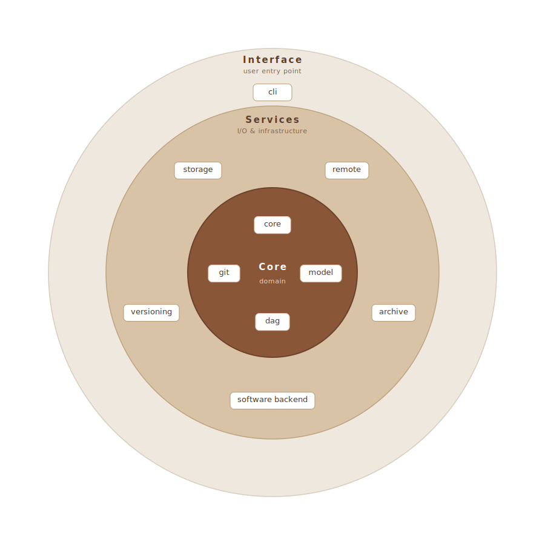

# Architecture

Omnibenchmark's packages are layered top (user-facing) to bottom (foundation);
imports only ever point downward, so the dependency graph stays acyclic. The
diagram below is interactive — **click any box to jump to that package's source
on GitHub**.

  <object data="../assets/architecture.svg" type="image/svg+xml" width="520" aria-label="Layered architecture overview">
    
  </object>

Diagram by <a href="https://github.com/daninci">daninci</a> (<a href="https://github.com/omnibenchmark/omnibenchmark/pull/341#issuecomment-4610392101">#341</a>).

The full package table and the auto-generated dependency graph live in
[`ARCHITECTURE.md`](https://github.com/omnibenchmark/omnibenchmark/blob/main/ARCHITECTURE.md),
which is regenerated from the package docstrings and real imports by
`scripts/gen_architecture.py`.
