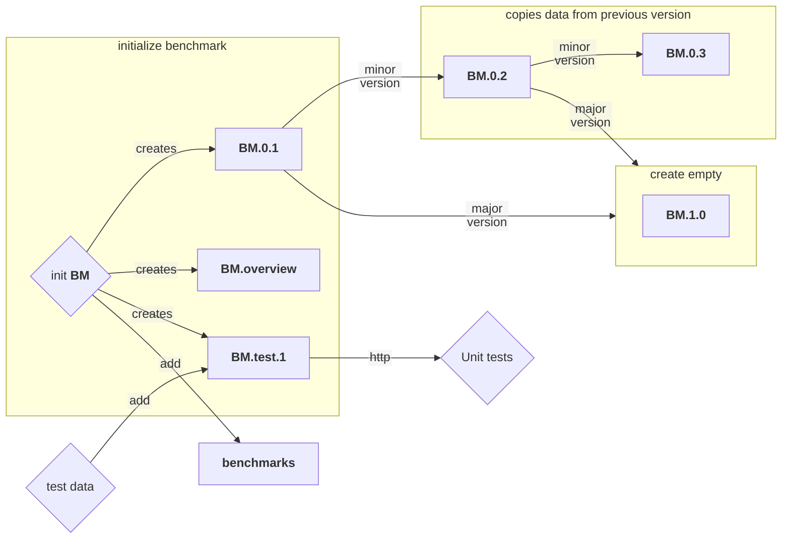

# Overview

Helper functions to interact with remote storage (default: MinIO) to create versions of benchmarks. The following is a short description. 
Each version is a single bucket. On creation of a new benchmark with name `BM` three buckets are created: `BM.0.1`, `BM.test.1` and `BM.overview`. `BM.0.1` is the main bucket for the benchmark that will store all the data. `BM.test.1` is a bucket that will store the test data. `BM.overview` contains a list of empty files representing the available versions of the benchmark. The versioning of the benchmark is done with a `major` and `minor` version schema (`BM.0.1` means major version 0 and minor version 1). An increment in the minor version (e.g. `BM.0.2`) means that all data of the previous version will be copied (or only the data that will remain unchanged). An increment in the major version (e.g. `BM.1.0`) means an empty bucket is created. But why `BM.overview`? This is necessary because public access over HTTP does not allow to list the available buckets of an account. The version information about available benchmarks is needed if public download of files for testing is needed.
Additionally, an empty file `BM` is created in the bucket `benchmarks`. The bucket `benchmarks` has a similar purpose as `BM.overview` insofar as it is needed to list all available benchmarks of a remote storage.





# How to use S3Storage/MinIOStorage

## get new access key

In the MinIO Console navigate to 'Access Keys' and click 'Create access key'. Set 'Restrict beyond user policy' to 'ON'. Create new policy with

```
import omni
import json
policy = omni.io.S3config.benchmarker_access_token_policy(<BENCHMARK>)
print(json.dumps(policy, indent=2))
```

Replace the displayed policy with the output of the above command.
Enter a name (Preferable syntax: `Benchmark: <BENCHMARK>`) and a description. Click on `Create` and copy the access key and secret key. Save in a `<CONFIG>.json` file somewhere with the following format:

```
{"endpoint": "<URL>", "access_key": "<ACCESS_KEY>", "secret_key": "<SECURE_KEY>", "secure": false}
```

## setup

The to use the MinIOStorage or S3Storage class, use the following code:

```
import json
from omni.io.MinIOStorage import MinIOStorage

with open("<CONFIG>.json", "r") as file:
    auth_options = json.load(file)

ms = MinIOStorage(auth_options=auth_options, benchmark="<BENCHMARK>")
ms.versions
```

## example usage

See [examples/storage_usage.py](examples/storage_usage.py).
